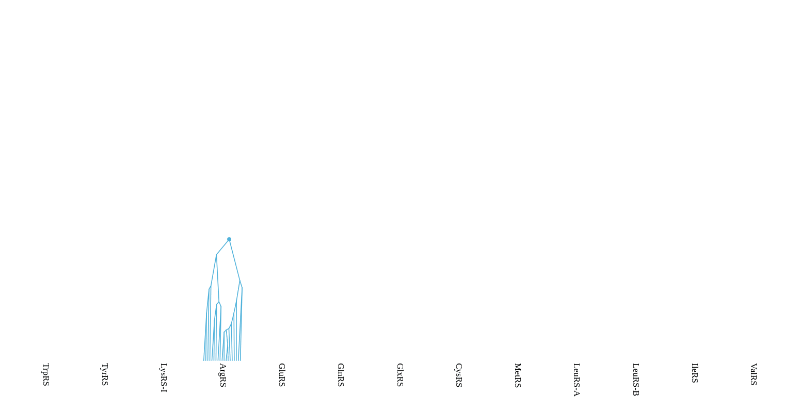

# IndelDollo 


Insertions and deletions through a stochastic Dollo process. Package is still under development and has not yet been published.


An intuitive total-evidence method for combining sequence and structural information in a phylogenetic analysis.


BEAST 2 implementation of a stochastic dollo model where sequence elements are acquired with an acquisition rate, and then mutate down a tree under standard substitution models. The elements can be irreversibly deleted with a loss rate.





## Installation instructions


This package requires BEAST 2.7 or newer

1. Launch BEAUti
2. Click on File -> Manage Packages
3. Install IndelDollo. If IndelDollo is not in the list of packages, you may need to add an extra package repository as follows:

- click the packager repositories button. A dialog pops up.
- click the Add URL button. A dialog is shown where you can enter https://raw.githubusercontent.com/CompEvol/CBAN/master/packages-extra-2.7.xml
- click the OK button. There should be an extra entry in the list.
- click Done
- After a short delay, IndelDollo should appear in the list of packages.


## Running IndelDollo


Please see the examples/ folder for working XML files. At this stage, IndelDollo analyses cannot be generated using BEAUti.


## Postprocessing


The pruned trees in any given log file may have differing taxonsets. This stumps most of the tree parsers in BEAST2. 
To summarise a posterior distribution of pruned trees, use the PrunedTreeAnnotator tool in IndelDollo:

```
path/to/beast/bin/applauncher PrunedTreeAnnotator -burnin 10 -trees in.trees -out mcc.tree
``` 

This method first finds the most commonly occurring taxonset, and then finds the maximum clade credibility (mcc) tree among the trees which share that taxonset.


